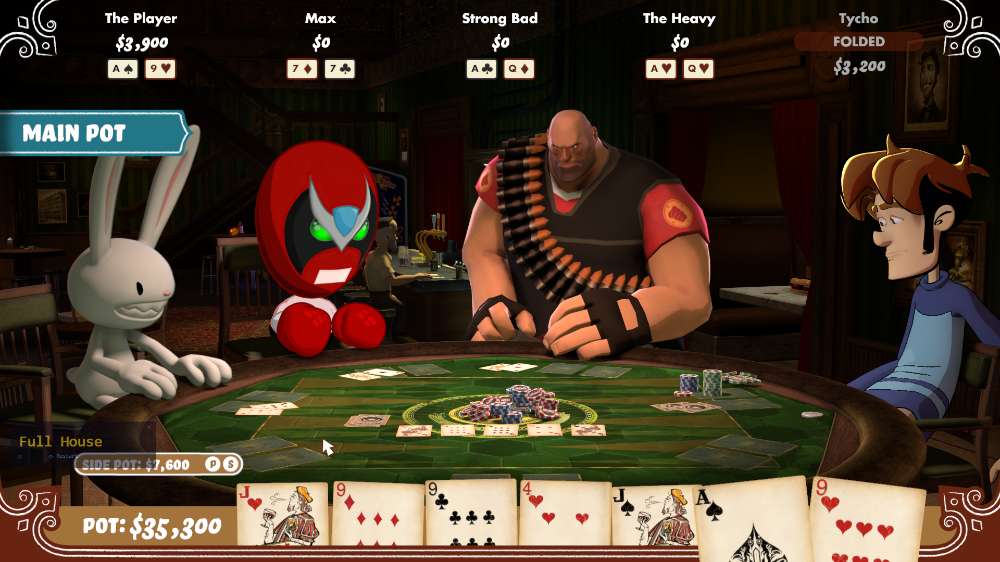

# Poker Night Hand Teller

A memory-reading overlay mod for **Poker Night at the Inventory** (Remastered) that shows your current best poker hand in real time.



## What it does

- Reads your hole cards and community cards directly from the game's Lua heap
- Evaluates your best possible hand from all available cards
- Displays the hand name (e.g. "Full House", "Flush", "Two Pair") in a small overlay on top of the game
- The overlay is only visible when the game window is active
- Automatically closes when the game exits

## Download

Grab the latest `HandTeller.exe` from the [Releases page](https://github.com/qequ/poker-night-hand-teller/releases). No installation needed, just download and run.

## Requirements

- Windows 10/11 (x64)
- .NET Framework 4.0+ (included in Windows)
- Poker Night at the Inventory (Remastered) / `CelebrityPoker.exe`

## Usage

### Option 1: Steam Launch Options (recommended)

Right-click the game in Steam > **Properties** > **General** > **Launch Options** and add:

```
cmd /c start "" "C:\path\to\HandTeller.exe" & %command%
```

Replace `C:\path\to\` with the actual path where you placed `HandTeller.exe`. This launches the mod automatically with the game and closes it when the game exits.

### Option 2: Manual launch

1. Launch the game
2. Run `HandTeller.exe`
3. Wait ~20 seconds for the initial memory scan
4. Play poker. The overlay shows your best hand.

## Overlay controls

- **Drag** the overlay to reposition it
- **Retry** re-scans the player anchor (use if cards aren't showing)
- **Restart** does a full re-scan from scratch
- **X** closes the mod

## How it works

HandTeller reads the game's process memory to navigate Telltale's Lua 5.1 VM heap. It finds the human player object via a TString scan, then follows the pointer chain through `HumanPlayer > cHand > holeCards/cards > Card[rank, suit]` to read your cards every 3 seconds.

The hand evaluator tries every C(n,5) combination from your 2-7 available cards and returns the best hand.

For a detailed writeup of the reverse engineering process, see [the blog post](https://qequ.dev/blog/poker-night-hand-teller).

## Building from source

Requires the .NET Framework 4.0 C# compiler (included with Windows):

```powershell
.\build.ps1
```

Or manually:

```powershell
C:\Windows\Microsoft.NET\Framework64\v4.0.30319\csc.exe `
    /out:HandTeller.exe /target:winexe /unsafe+ /platform:x64 `
    /r:System.Windows.Forms.dll /r:System.Drawing.dll `
    src\HandTeller\MemoryReader.cs src\HandTeller\AnchorNav.cs `
    src\HandTeller\HandEvaluator.cs src\HandTeller\Overlay.cs `
    src\HandTeller\Program.cs
```

## License

MIT
